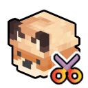
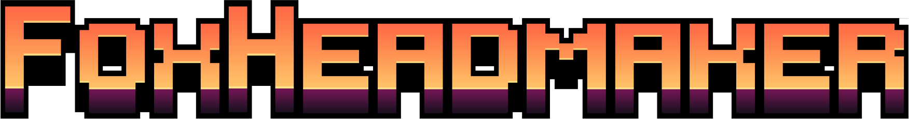
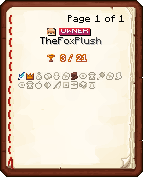
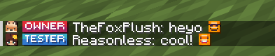
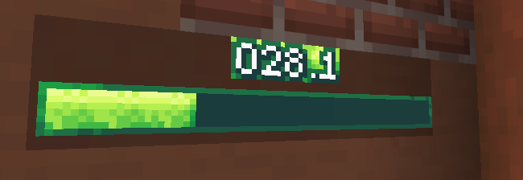
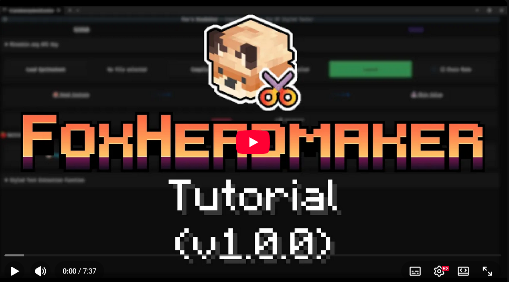

<h1 align="center">
    
    
</h1>

  <i align="center">Easily make custom 8x8 sprites in DiamondFire, for everyone! ✂️</i>

<h4 align="center">
  
</h4>

## Introduction

FoxHeadmaker is a [TUI](https://en.wikipedia.org/wiki/Text-based_user_interface) that allows players of [DiamondFire](https://https://mcdiamondfire.com/) to convert any [spritesheet](https://en.wikipedia.org/wiki/Texture_atlas) that they want into a series of 8x8 symbols stored in Styled Texts, that can be used in any textual context when coding a plot, _without a resource pack_.

The interface splits sprites from the spritesheet and uses the [mineskin](https://mineskin.org/) [API](https://docs.mineskin.org/docs/category/mineskin-api) to convert these into Minecraft Skin Values, the face of which that can be used to make symbols in chat since [25w35a](https://www.minecraft.net/en-us/article/minecraft-snapshot-25w35a).

## Why?

This can be accomplished with greater customization potential using [resource packs](https://minecraft.wiki/w/Resource_pack). However, resource packs on DiamondFire are only available with a paid rank, while this technology works with any player, _even default players_; and resource packs, especially [custom font systems required to accomplish something like this](https://minecraft.wiki/w/Font), can be difficult to pick up.

My hope in publishing tools to make this technology easier to handle for any player is to give to any player the opportunity to polish their games without needing to spend money on the server.

## Usage

A video showcasing how to use the tool is available below.

## Contact

Communication and feedback about the software is welcome on the [Discord](https://discord.gg/xjpaRGCTgY), where a dedicated category exists to receive suggestions, bug reports, showcases of heads you have made, etc..
